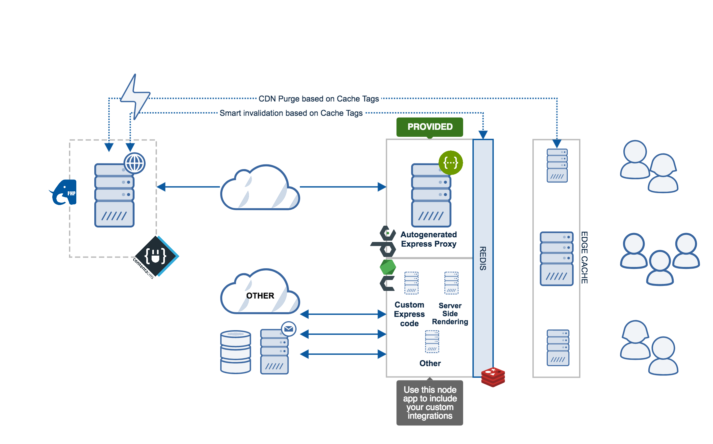

<!--
  This file was generated by emdaer

  Its template can be found at .emdaer/README.emdaer.md
-->

<h1 id="contentajs-img-align-right-src-logo-svg-alt-contenta-logo-title-contenta-logo-width-100-">ContentaJS </h1>

ContentaJS is a project that integrates with Contenta CMS to provide
an ultra high performing headless CMS.

<strong>IMPORTANT:</strong> this project is meant to be a starting kit for the node
integration of your application based on Contenta CMS. We <strong>do not</strong> provide
upgrade paths or backwards compatibility. The model for this is <em>Fork &amp; Go</em>. If
you have an existing application and want to include some new features to it
based on this repo’s latest updates you will have to do it yourself. However
this repo will help you figure out the necessary details for it.

<!-- toc -->
<ul>
<li><a href="#features">Features</a></li>
<li><a href="#installation">Installation</a><ul>
<li><a href="#local-installation">Local Installation</a></li>
<li><a href="#aws-installation">AWS Installation</a></li>
<li><a href="#install-using-docker">Install Using Docker</a><ul>
<li><a href="#notes">Notes</a></li>
</ul>
</li>
</ul>
</li>
<li><a href="#contributors">Contributors</a></li>
<li><a href="#license">License</a></li>
</ul>
<!-- tocstop -->

 

<h2 id="features">Features</h2>

<em>This section is still under development.</em>

The main features of this project cover:

<ul>
<li>Automatic integration with the API exposed by your Contenta CMS install.
Just provide the URL of the site and everything is taken care of for you.</li>
<li>Multi-threaded nodejs server that takes advantage of all the cores of the
server’s CPU.</li>
<li>A <a href="http://redis.io">Redis</a> integration. This comes with a connection pool to
eliminate latency obtaining connections with the server.</li>
<li>Type safe development environment using <a href="http://flow.org">Flow</a>.</li>
</ul>
<h2 id="installation">Installation</h2>

In order to install ContentaJS you will need to meet the following requirements:

<ul>
<li><code>nodejs</code> ^8.11.1 or higher.</li>
<li>A working installation of <a href="https://github.com/contentacms/contenta_jsonapi">Contenta CMS</a>.</li>
<li>A Redis server.</li>
</ul>
<h3 id="local-installation">Local Installation</h3>

<em>Fill in the instructions on how to install locally</em>

<h3 id="aws-installation">AWS Installation</h3>

<em>Fill in the instructions on how to install in AWS with ElastiCache using CloudFormation or a custom AMI</em>

<h3 id="install-using-docker">Install Using Docker</h3>

<em>Fill in the instructions on how to install using Docker. Ideally this installs
Contenta CMS (Drupal), ContentaJS, and the Redis server.</em>

<h4 id="notes">Notes</h4>

<em>This is a dumping ground of notes. This section will disappear eventually, it’s
just meant to save ideas for documentation to process some other time.</em>

<ul>
<li>Mention that both Drupal and node need to talk to the same Redis server.</li>
</ul>
<h2 id="contributors">Contributors</h2>

<strong>Contributors</strong>
 

<strong>Mateu Aguiló Bosch</strong>
  

<h2 id="license">License</h2>

@contentacms/contentajs is <a href="./LICENSE">MIT licensed</a>.

