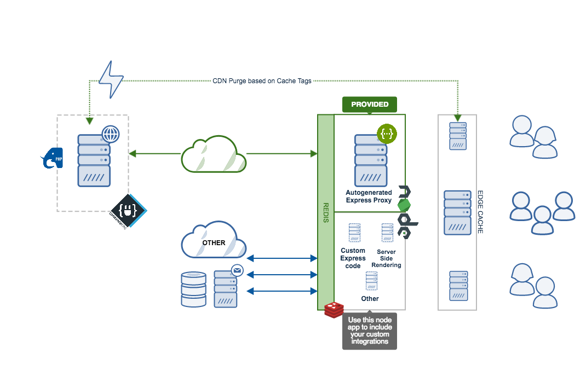

<!--
  This file was generated by emdaer

  Its template can be found at .emdaer/README.emdaer.md
-->

<!--
  emdaerHash:6a0ac3213af886b61b0a58a3f2e822bd
-->

<h1 id="contentajs-img-align-right-src-logo-svg-alt-contenta-logo-title-contenta-logo-width-100-">ContentaJS </h1>

ContentaJS is a project that integrates with Contenta CMS to provide
an high performing headless CMS. It also provides a nodejs application
where to host your Server Side Rendering and custom code integrations.

<strong>IMPORTANT:</strong> this project is meant to be a starting kit for the node
integration of your application based on Contenta CMS. We <strong>do not</strong> provide
upgrade paths or backwards compatibility. The model for this is <em>Fork &amp; Go</em>.

<!-- toc -->
<ul>
<li><a href="#videos">Videos</a><ul>
<li><a href="#contenta-js-introduction">Contenta JS: Introduction</a></li>
<li><a href="#tutorial-install-contenta-cms--contenta-js">Tutorial: Install Contenta CMS + Contenta JS</a></li>
</ul>
</li>
<li><a href="#why">Why?</a><ul>
<li><a href="#microservices">Microservices</a></li>
<li><a href="#server-side-rendering">Server-Side Rendering</a></li>
<li><a href="#performance">Performance</a></li>
<li><a href="#other">Other</a></li>
</ul>
</li>
<li><a href="#features">Features</a></li>
<li><a href="#installation">Installation</a></li>
<li><a href="#internal-development-notes">Internal Development Notes</a></li>
<li><a href="#contributors">Contributors</a></li>
<li><a href="#license">License</a></li>
</ul>
<!-- tocstop -->

     

<h2 id="videos">Videos</h2>
<h3 id="contenta-js-introduction">Contenta JS: Introduction</h3>

<h3 id="tutorial-install-contenta-cms-contenta-js">Tutorial: Install Contenta CMS + Contenta JS</h3>

<h2 id="why-">Why?</h2>

<strong>Contenta CMS</strong> (aka <em>the Drupal part</em>) is designed to serve your project’s
content. ContentaJS (aka <em>the node.js part</em>) is designed to serve the requests
to your client side applications. Some of those requests will end up requesting
data from Contenta CMS, others won’t.

You may need <strong>ContentaJS</strong> because for many reasons <strong>you will end up needing a
node.js server for your project anyways</strong>. You may as well use an opinionated
and optimized starter kit that will solve many of your needs without effort.

<h3 id="microservices">Microservices</h3>

If your API needs to aggregate data for use on the front-end from other services
you <strong>should not</strong> use PHP for that. That is because, in practice, all I/O in
Drupal is blocking and the performance of these tasks is usually very poor.

Examples of this are:

<ul>
<li>Showing weather data from a 3rd party API.</li>
<li>If you need to make requests to an analytics tool.</li>
<li>If you need to run a request through an anti-fraud service before accessing the content.</li>
</ul>

In these situations you will want to treat <strong>Contenta CMS</strong> just as any other
microservice. Then you will need a server, like this one written in node.js, to
orchestrate the different microservices.

<h3 id="server-side-rendering">Server-Side Rendering</h3>

Chances are that you are building a website as part of your digital project. In
most cases you will be using a front-end framework like React, Vue, Angular,
etc. All of those frameworks recommend using server-side rendering
<a href="https://ssr.vuejs.org/#why-ssr">for many reasons</a>. In order to implement
server-side rendering you will need a node.js server.

You can use this node.js server (aka <em>ContentaJS</em>) to implement server-side
rendering on.

<h3 id="performance">Performance</h3>

Your LAMP stack (or alternative) runs your Contenta CMS installation. We all
know how flexible and powerful Drupal is. But at the same time it is not great
from a performance point of view. In fact it can rapidly become your bottleneck.

With ContentaJS you can reduce the load in your LAMP stack. This is because you
don’t even need to hit this stack to access cached responses. ContentaJS will
fetch the data from cache, and will only check with Drupal when there is no
cache. That reduces greatly the amount of requests Apache needs to process. This
reduces the load on Drupal, hence improving performance overall.

ContentaJS integrates transparently with Contenta CMS and can analyze requests
that will fail in Drupal. When that happens the request never hits Drupal thus
reducing the load there. Examples of this are: a request to a non-existing
resource, a request that contains a payload that doesn’t validate against the
schema of the resource, etc.

<h3 id="other">Other</h3>

Other server tasks like executing actions on cron, or sending emails, etc. can
be done in this node.js server (and/or the machine running it) instead of on
the LAMP stack.

<h2 id="features">Features</h2>

<em>This section is still under development.</em>

The main features of this project cover:

<ul>
<li>Automatic integration with the API exposed by your Contenta CMS install.
Just provide the URL of the site and everything is taken care of for you.<ul>
<li>JSON API integration.</li>
<li>JSON RPC integration.</li>
<li>Subrequests integration.</li>
<li>Open API integration.</li>
</ul>
</li>
<li>Multi-threaded nodejs server that takes advantage of all the cores of the
server’s CPU.</li>
<li>A Subrequests server for request aggregation. Learn more about <a href="./.emdaer/docs/subrequests.md">subrequests</a>.</li>
<li>A <a href="http://redis.io">Redis</a> integration via <a href="https://github.com/contentacms/contentajsRedis">@contentacms/redis</a>.</li>
<li>Type safe development environment using <a href="http://flow.org">Flow</a>.</li>
<li><a href="https://github.com/contentacms/contentajs/blob/master/config/default.yml#L66-L85">Configurable CORS</a>.</li>
</ul>
<h2 id="installation">Installation</h2>

In order to install ContentaJS you will need to meet the following
<strong>requirements</strong>:

<ul>
<li><code>nodejs</code> ^8.11.1 or higher. This corresponds to <code>lts/carbon</code>.</li>
<li>A working installation of <a href="https://github.com/contentacms/contenta_jsonapi">Contenta CMS</a>.</li>
<li>A Redis server (optional). Use the
<a href="https://github.com/contentacms/contentajsRedis">@contentacms/redis</a> module
to leverage the Redis cache back-end.</li>
</ul>

See the <a href="./docs/install.md">installation instructions</a>.

<h2 id="internal-development-notes">Internal Development Notes</h2>

<em>This is a dumping ground of notes. This section will disappear eventually, it’s
just meant to save ideas for documentation to process some other time.</em>

<ul>
<li>Introduce the ability to timeout requests.</li>
<li>Create a separate package using passport to integrate with Simple OAuth.</li>
<li>If all subrequests are to the CMS forward the blueprint to Drupal’s subrequests.</li>
<li>Compute the appropriate cache-control header from subquests responses.</li>
<li>Make sure to mention that the /healthckeck is for auto-scaling policies.</li>
<li>Create a @contentacms/redisShare submodule for a shared Redis server between
Drupal and node.</li>
<li>Document that the proxied requests are not cached because they are considered
end responses. The appropriate caching should be in the edge cache layer.</li>
<li>Make Cache-Control header overrides configurable.</li>
<li>Check feature conflict between cors.maxAge and OPTIONS cache control header.</li>
<li>Document better the JSON RPC support.</li>
<li>Add documentation about the cache controls</li>
</ul>
<h2 id="contributors">Contributors</h2>

<strong>Contributors</strong>
 

<strong>Mateu Aguiló Bosch</strong>
  

<h2 id="license">License</h2>

@contentacms/contentajs is <a href="./LICENSE">MIT licensed</a>.

